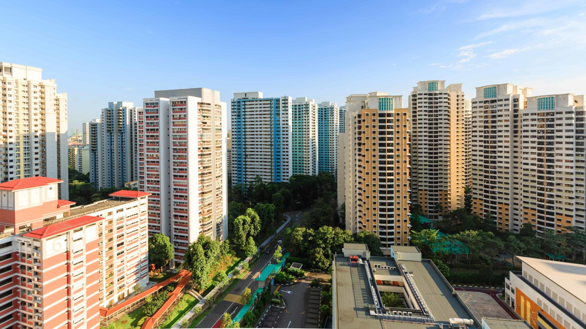
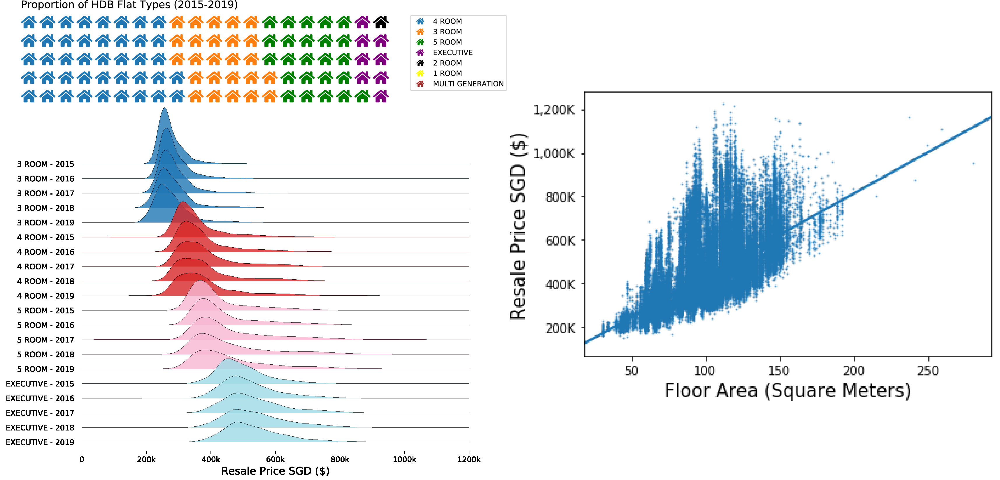
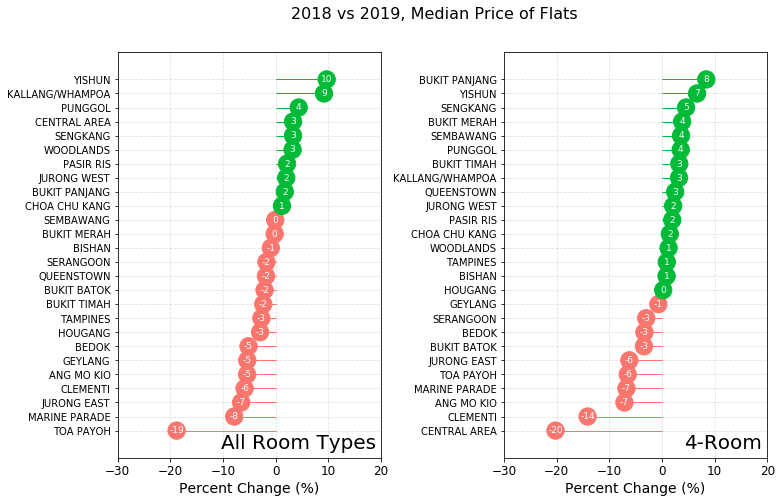
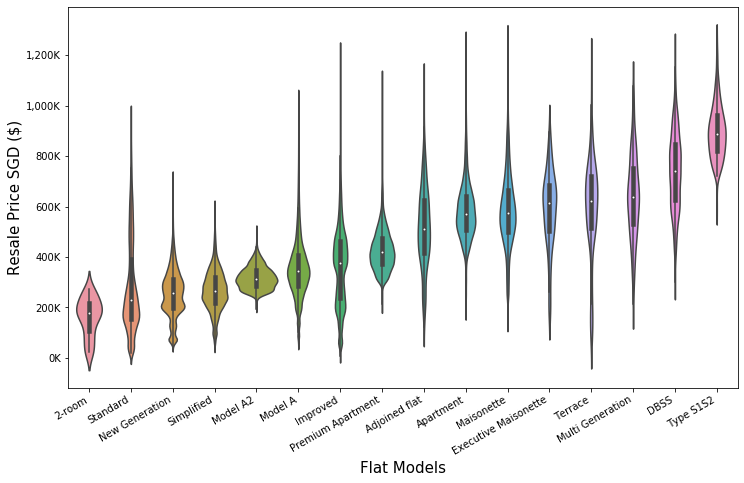
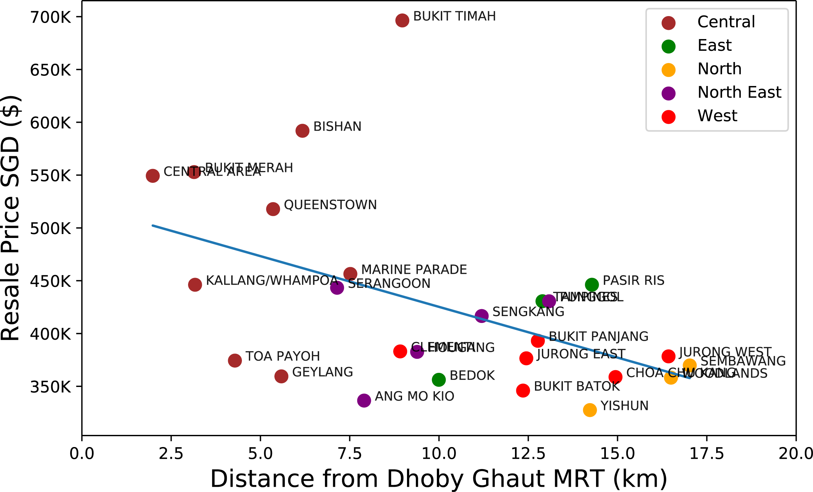
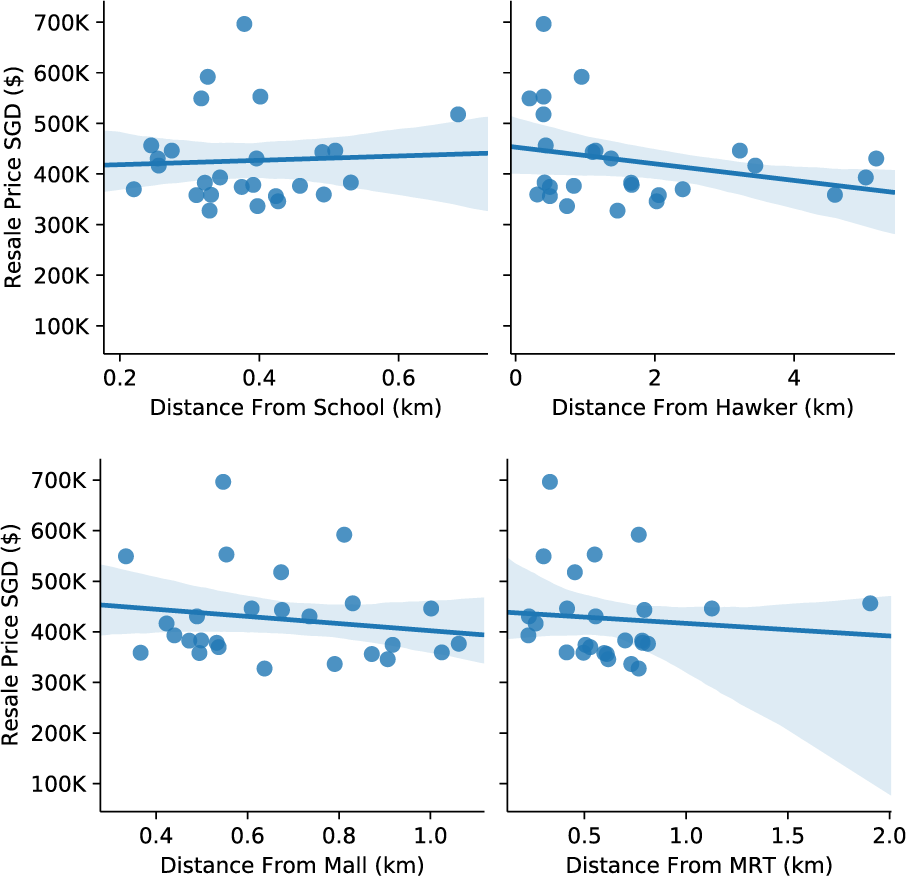
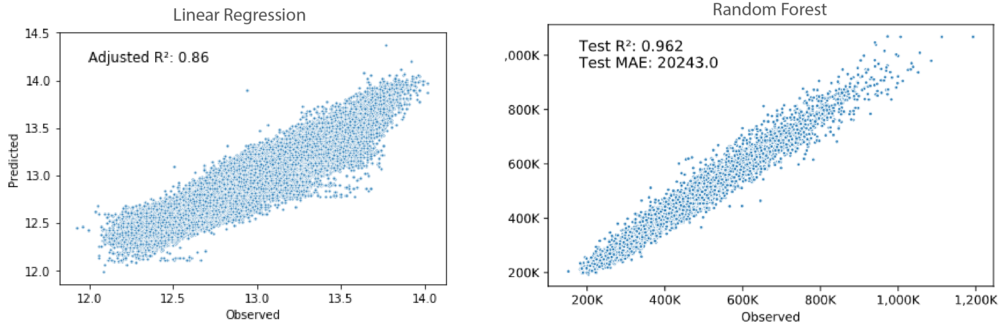
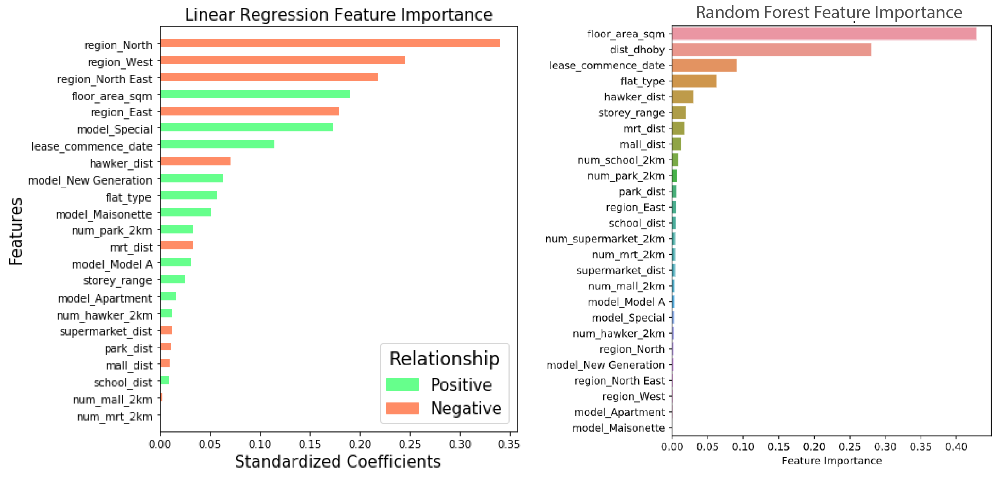

# Drivers of HDB Resale Price

Author: TeYang, Lau  

Last Updated: 11 January 2021

 

### **Please refer to this [notebook](https://nbviewer.jupyter.org/github/teyang-lau/HDB_Resale_Prices/blob/main/flat_prices.ipynb) for a more detailed analysis of the project.** ###

### If it takes a long time to load, the [html file](https://github.com/teyang-lau/HDB_Resale_Prices/blob/main/flat_prices.html) can also be downloaded. 

 

## Project Goals ##

1. Start a end-to-end project, from scraping data, to cleaning, modelling, and deploying the model
2. To **identify** the drivers of HDB resale prices in Singapore.
3. To **scrape** and **engineer** additional features from online public datasets that might also influence resale prices
4. To **deploy** the model  onto a web app, allowing for HDB resale prices prediction for different HDB features

 

## Feature Engineering

The names of schools, supermarkets, hawkers, shopping malls, parks and MRTs were downloaded/scraped from [Data.gov.sg](https://data.gov.sg/) and Wikipedia and fed through a function that uses [OneMap.sg](https://www.onemap.sg/main/v2/) api to get their coordinates (latitude and longitude). These coordinates were then fed through other functions that use the geopy package to get the distance between locations. By doing this, the nearest distance of each amenity from each house can be computed, as well as the number of each amenity within a 2km radius of each flat.

The script for this can be found [here](https://github.com/teyang-lau/HDB_Resale_Prices/blob/main/get_coordinates.ipynb).

 

## EDA

Between 2015 to 2019, `4 Room`, `3 Room`, `5 Room` and `Executive` flat types made up the majority of resales, and their prices did not change much throughout the years. Their resale price did increase as the number of rooms increase, as well as for `floor area`.

 

The changes in median price amongst the `towns` are not very large from 2018 to 2019, although prices for Toa Payoh and Central Area 4-room flats dropped by about 20%. Other factors might also influence the resale price in addition to the neighborhood/town location of the flats.

 

Unsurprisingly, `flat models` also have an effect on the resale price. The special models like the Type S1S2 (The Pinnacle@Duxton) and Terraces tend to fetch higher prices while the older models from the 1960s to 1970s (Standard and New Generation models) tend to go lower.

 

The median distance of each town appears to be negatively correlated with its median resale price, suggesting that distance to the most frequented station of Singapore is a likely driver to how much people pay for HDB flats. Distances from the nearest amenities like hawker centers and malls also appear to have a small relationship.

 

## Linear Regression and Random Forest Performance

Linear regression was done using a statistical approach with no train-test splitting. The model achieved an **adjusted R2 of 0.90**. For the random forest, the data was split into a 9:1 train test ratio, and validated using both Out-Of-Bag and K-fold cross validation methods. Both achieved a **test R2 of 0.96** and **mean absolute error of ~$20,000**. 

 

## Feature Importance

Feature importance from the 2 models are slightly different. Linear regression showed that `region` and `floor area` are the best predictors of resale prices while for random forest, `floor area` and `distance from Dhoby Ghaut MRT` are the best predictors.

 

## Model Deployment to Web App

I deployed the random forest model onto a web app using Streamlit. It allows users to input HDB features into the app and get the predicted resale price. It also shows the map of Singapore, with the location of the flat, and the nearby amenities within a 2km radius.

 

## Conclusion

In this project, linear regression and random forest were used to looked at the drivers of HDB resale prices. Linear regression is powerful because it allows one to interpret the results of the model by looking at its coefficients for every feature. However, it assumes a linear relationship between the features and the outcome, which isn't always the case in real life. It also tends to suffer from bias due to its **parametric** nature. Conversely, **non-parametric** methods do not assume any function or shape, and random forest is a powerful non-linear machine learning model which uses **bootstrap aggregating (bagging)** and **ensembling** methods. A single decision tree has high variance as it tends to overfit to the data. Through bagging and ensembling, it is able to reduce the variance of each tree by combining them.

Looking at the output of the models, linear regression showed that `regions`, `floor area`, `flat model`, `lease commencement date` and `distance from hawker` are the top 5 drivers of HDB prices. However, random forest gave a slightly different result. `floor area`, and `lease commencement date` and `distance from hawker` still in the top 5 while `distance from Dhoby Ghaut MRT` and `flat type` has also came up on top. This could be due to tree-based models giving lower importance to categorical variables (`region` and `flat model`) due to the way it computes importance.

Nevertheless, the **size of the flat**, **lease date**, and certain aspects of **location** appears to be consistently the most important drivers of HDB resale prices.

